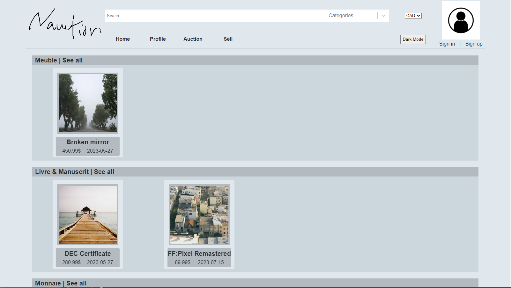
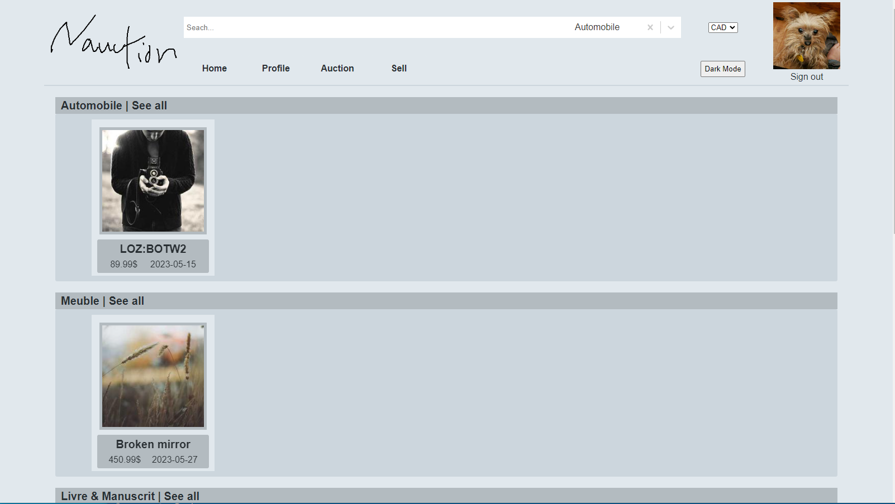
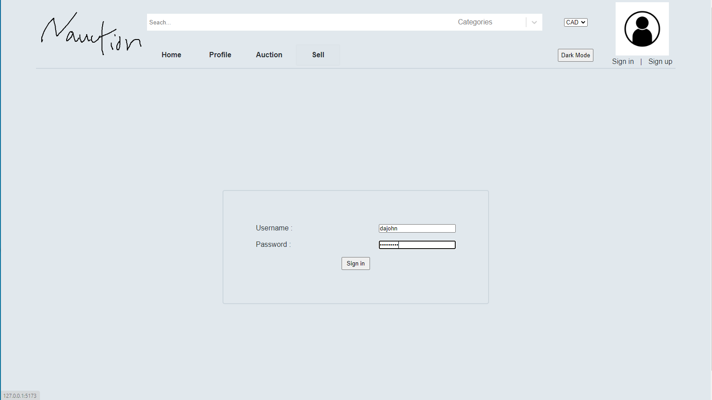
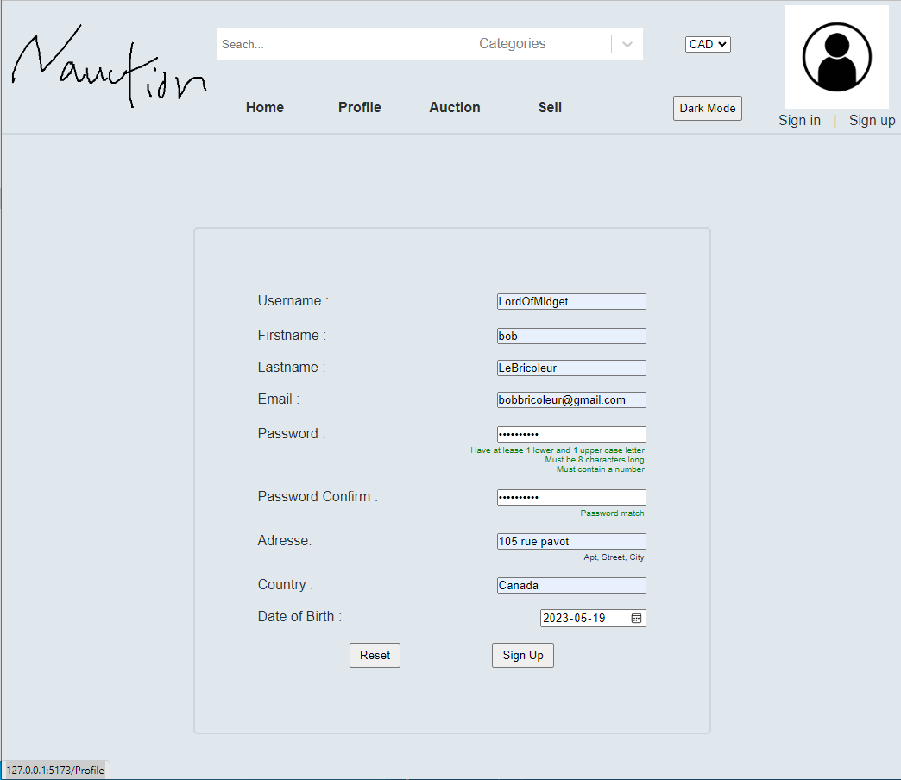
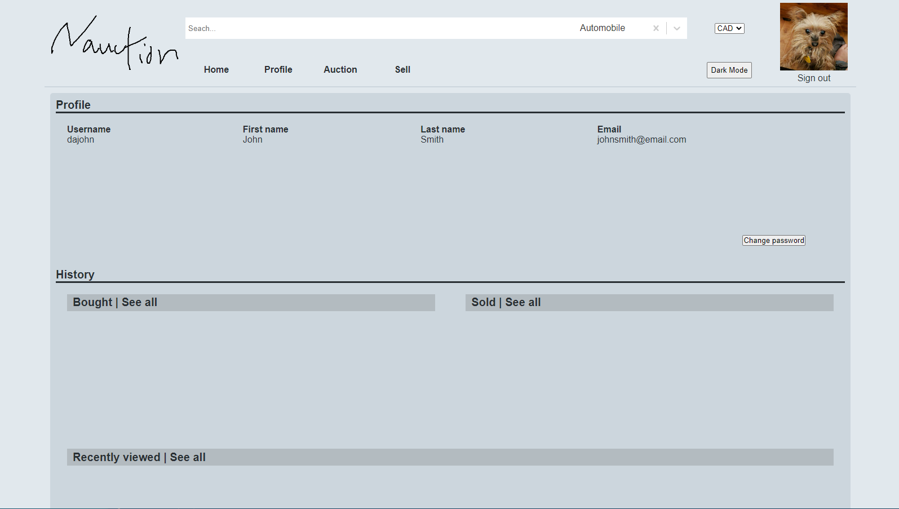
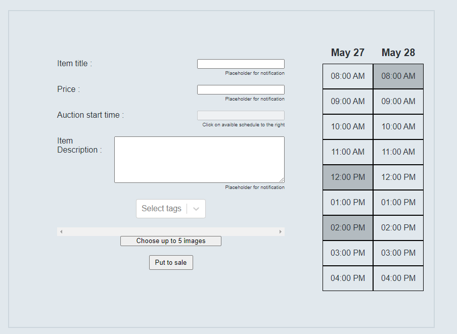
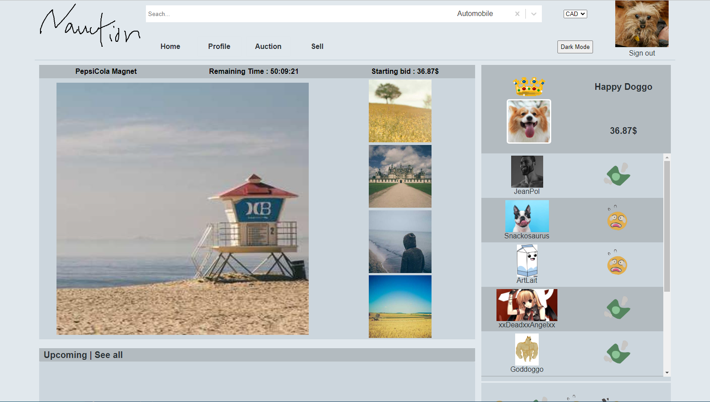
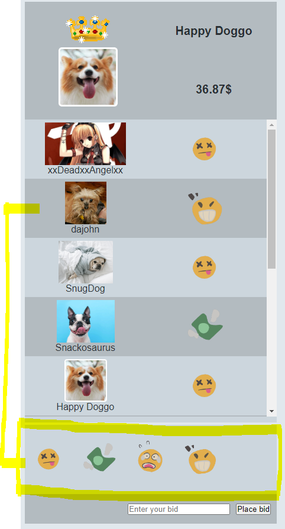
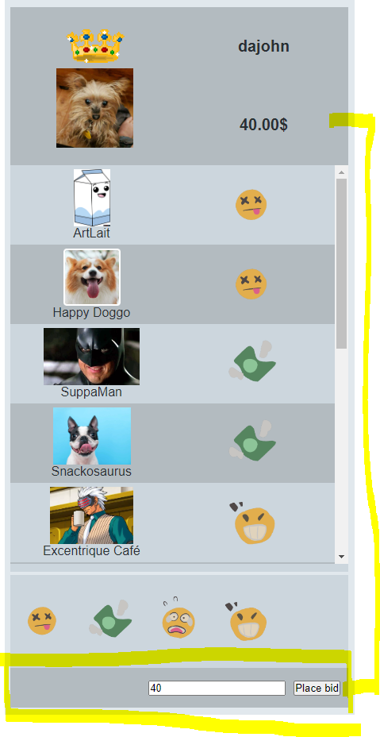

<h3 align="center">C61_NAuction/Auction Zone</h3>

  <p align="center">
    <i> Bringing authentic auction to your home</i>
    <br />
    <br />
    <br />
    <a href="https://github.com/github_username/repo_name">View Build</a>
  </p>
</div>


<!-- TABLE OF CONTENTS -->
<details>
  <summary>Table of Contents</summary>
  <ol>
    <li>
      <a href="#getting-started">Getting Started</a>
      <ul>
        <li><a href="#prerequisites">Prerequisites</a></li>
        <li><a href="#installation">Installation</a></li>
      </ul>
    </li>
    <li><a href="#usage">Usage</a></li>
    <li><a href="#contact">Contact</a></li>
    <li><a href="#acknowledgments">Acknowledgments</a></li>
  </ol>
</details>


<p align="right">(<a href="#readme-top">back to top</a>)</p>


<!-- GETTING STARTED 
Installation Instructions nécessaires à la mise en place de l’infrastructure de développement (langage, librairie, IDE …). Ces informations sont destinées à un programmeur qui désire utiliser votre projet dans un contexte de développement.
-->
## Getting Started

This is an example of how you may give instructions on setting up your project locally.
To get a local copy up and running follow these simple example steps.

### Prerequisites

Here is the required list of software you need to install


* PgAdmin - https://www.pgadmin.org/download/pgadmin-4-windows/
* node.js - https://nodejs.org/en/download
* npm
  ```sh
  npm install npm@latest -g
  ```

### Installation

1. Clone the repo
   ```sh
   git clone https://github.com/github_username/repo_name.git
   ```
2. Se connecter à PGAdmin sur ordinateur local
3. Create user "nath" with the password: "AAAaaa111"
    ```
    CREATE ROLE nath WITH
	LOGIN
	SUPERUSER
	CREATEDB
	CREATEROLE
	INHERIT
	NOREPLICATION
	CONNECTION LIMIT -1
	PASSWORD 'AAAaaa111'; 
    ```
4. Create a new database named "AuctionZone"
    ````
    CREATE DATABASE "AuctionZone"
    WITH 
    OWNER = nath
    ENCODING = 'UTF8'
    CONNECTION LIMIT = -1;
    ```
5. Run the query in these file : 
    ```
    \C61_NAuction\C61\assets\sql\create_table.sql
    \C61_NAuction\C61\assets\sql\insert_table.sql
    ```
6. Install NPM packages in these folders: 
    - \C61_NAuction\dev\api
    - \C61_NAuction\dev\app
   ```sh
   npm install
   ```
7. Run node using the index.js in \C61_NAuction\dev\api:
    ```sh
    node .\index.js
    ```
8. Run npm script to run the React application:
    ```sh
    npm run dev
    ```
9. Open the link: http://127.0.0.1:5173

<p align="right">(<a href="#readme-top">back to top</a>)</p>


<!-- USAGE EXAMPLES 
Utilisation Cette section indique comment démarrer votre projet et quels sont les usages fondamentaux (ici, sans être nécessaires, des captures d’écran sont généralement appréciées). Cette section est généralement pertinente pour expliquer la philosophie d’usage de la librairie. On s’adresse généralement aux programmeurs utilisateurs de votre projet.-->
## Usage

- Users can view recommandations without being loggeg in

- Users can view personalized recommandations if they're connected

- Users can login using their username and password

- Users can create an account once all the fields are checked
 
- Users who are connected can see their informations on the profile page

- Users can submit an item to be put in auction with the specific informations/requirements

- Users can view the next item on the auction page

- Users can submit messages on the auction page

- Users can submit a higher bid to be the current leader



<p align="right">(<a href="#readme-top">back to top</a>)</p>

<!-- References -->
## References & Documentation

Collate insensitive :
```
https://www.cybertec-postgresql.com/en/icu-collations-against-glibc-2-28-data-corruption/
https://stackoverflow.com/questions/71663281/postgresql-case-insensitive-and-accent-insensitive-search
https://stackoverflow.com/questions/7005302/how-to-make-case-insensitive-query-in-postgresql
```
Drop down menu:
``` 
https://www.simplilearn.com/tutorials/reactjs-tutorial/how-to-create-functional-react-dropdown-menu#:~:text=DevelopmentExplore%20Program-,What%20Are%20Dropdowns%3F,the%20dropdown%20list%20is%20fixed.
```
React Carousel
```
https://blog.logrocket.com/building-carousel-component-react-hooks/
https://blog.logrocket.com/react-hooks-cheat-sheet-solutions-common-problems/
https://www.youtube.com/watch?v=sR5Z8AJ-zRU
https://www.npmjs.com/package/react-multi-carousel
```
React Context
```
https://www.youtube.com/watch?v=MCTB_w0Guso
```
Enumerate pour State
```
https://www.delftstack.com/fr/howto/javascript/javascript-enum/#:~:text=Les%20Enums%2C%20%C3%A9galement%20appel%C3%A9es%20%C3%A9num%C3%A9rations%2C%20sont%20utilis%C3%A9es%20pour,pouvez%20utiliser%20le%20mot-cl%C3%A9%20const%20et%20des%20accolades.
```

SSH Tunnel (from when the api was hosted on a server)
```
https://linuxize.com/post/how-to-setup-ssh-tunneling/
```

<!-- CONTACT -->
## Contact

Nathaelle Fournier - https://github.com/SakyunBuns
Quoc Huan Tran - https://github.com/ArsenTigor

Project Link: [https://github.com/SakyunBuns/C61_NAuction](https://github.com/SakyunBuns/C61_NAuction)

<p align="right">(<a href="#readme-top">back to top</a>)</p>


<!-- ACKNOWLEDGMENTS -->
## Acknowledgments

* Frédérick Thériault


<p align="right">(<a href="#readme-top">back to top</a>)</p>


